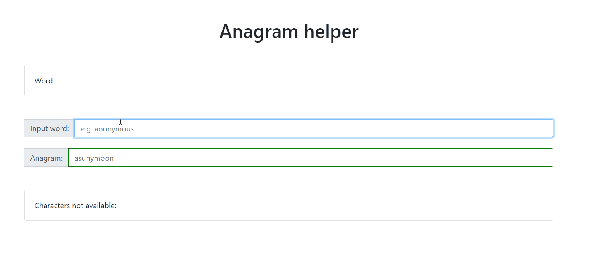

# Anagram helper.

> I remember my teacher said in secondary school that an invention of a speech and verbal communication is one of the important element for human being. To bring it on paper in written form is more phenomenal as it bears the information or thoughts which can be transmitted. I, in turn, adore the idea of replacing the characters and making a word with completely different meaning, i.e. anagrams. As I am not good at it, i tried to write a helper to create an anagram for word in plain javascript.  

Link for a [live example](https://mrustamov.github.io/anagramHelper/)

## Usage example

## Important to note.

> Later on, I discovered that in net exists similar apps written with ReactJS. E.g.   - [by](https://twitter.com/_dte/status/819214027792400384) Daniel Eden &   - [by](https://github.com/connorholyday/anagram-helper) Connor Holyday.

## License

